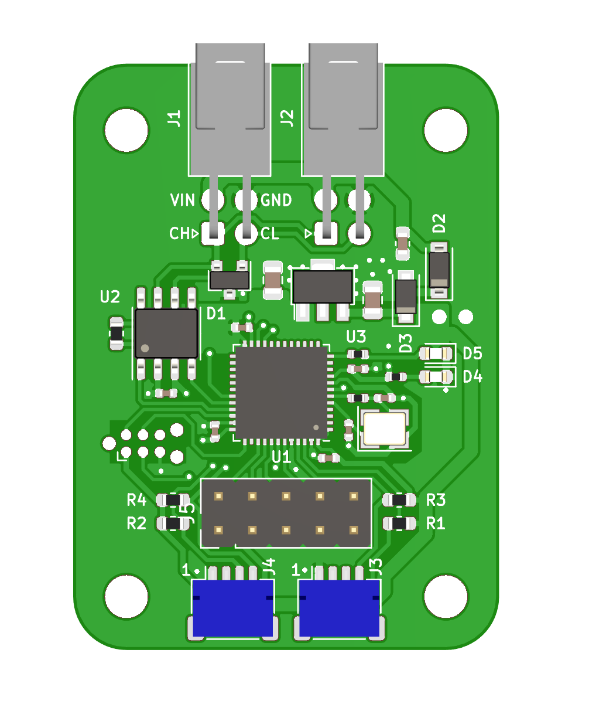

# can-sensor-board

# Pupose
To attach any I2C sensor to a CAN bus.

# Requirements
* Powered by 5-16V DC
* Input and output connector (daisy chain boards)
* Set address on board
* I2C 4 pin connector to quickly connect different sensor boards
* Programming header
* ESD protection on connector pins

# Pinout
### CAN and Power Connectors (J1 and J2)

Both of these connectors are the same, you can plug input OR output in to either one.

Wire connector: Molex 1053081204

| Pin Number | Function |
|--|--|
|1| CAN H |
|2 | CAN L |
|3 | VIN |
|4 | GND|

### I2C Connectors

Wire connector: Molex 1053081204

| Pin Number | Function |
|--|--|
|1| CAN H |
|2 | CAN L |
|3 | VIN |
|4 | GND|
